# Skyve Architecture & Design

## 1. Architecture at a Glance

### Scope

Skyve is a metadata-driven enterprise application platform that interprets XML declarations into secure, multi-tenant business applications with generated domain code, runtime UI rendering, and integrated persistence, search, content, and job orchestration.

### Stakeholders

| Stakeholder | Primary Concern |
|-------------|-----------------|
| Platform maintainers | Reliability, backward compatibility, operability |
| Application developers | Speed of feature delivery with low boilerplate |
| Security reviewers | Strong tenant isolation and fail-closed defaults |
| Operators/SRE | Predictable scaling, observability, recovery |
| Architects | Long-term evolvability and open exit path |

### Constraints

| Constraint | Architectural Implication |
|-----------|---------------------------|
| Single metadata source of truth | Runtime and generated code must remain metadata-aligned |
| Multi-tenant by default | All access paths must enforce customer/data-group/user scope |
| Multiple UI pipelines | View metadata must be renderer-agnostic |
| Database portability | Persistence layer must isolate dialect-specific behaviors |
| Customer overrides | Metadata resolution order must support tenant-first lookup |

### Top Architecture Decisions

| Decision | Why It Exists | Consequence |
|----------|----------------|-------------|
| Metadata-first model | Minimise boilerplate and centralise authority | Requires strict validation and metadata governance |
| Static validation gate (`generateDomain`) | Catch structural faults before runtime | Build pipeline is mandatory for safe change |
| Declarative authorization model | Prevent omission-based security defects | Higher up-front role/permission modeling effort |
| Conversation-oriented UI state | Preserve rich transactional user interactions | Requires cache/session integrity controls |
| Renderer-isomorphic view model | One declaration for multiple clients | Renderer-specific parity testing is required |

### Traceability to Quality Goals

The architecture is optimized for seven top-level outcomes:
1. Deterministic correctness before deploy.
2. Fail-closed security under misconfiguration.
3. Predictable multi-tenant isolation.
4. Controlled schema and API evolution.
5. Horizontal scalability under read-heavy and mixed workloads.
6. Fast recovery from service and data-plane failures.
7. Operational visibility sufficient for SLO-based incident response.

## 2. Why Skyve Exists

AI can now generate code at extraordinary speed. But speed without structure produces sprawl — thousands of lines of procedural code that no human (and no AI) can confidently reason about, validate, or secure. The bottleneck in 2026 is not writing code; it's **knowing that what was written is correct, secure, and maintainable**.

Skyve was designed for exactly this constraint — long before AI agents made it urgent. The core insight: **the nature of your data implies the system required to maintain it**. Instead of generating mountains of code to handle persistence, security, UI, search, and content for every entity, you *declare* a domain model in concise XML metadata. Skyve interprets that declaration at runtime — validating it exhaustively, enforcing security universally, rendering UIs across multiple targets, and managing schema evolution — all from that single source of truth.

This is not a legacy low-code platform. Skyve is a **metadata engine with a compiler-grade validation pipeline**. Every declaration is statically verified before deployment. When you need custom behaviour, you drop into Java with full framework support — but only at the exact point of divergence, not across the entire surface area.

The result: whether a human or an AI writes the metadata, the system guarantees correctness at build time, security at runtime, and maintainability over the life of the application.

### Design Principles

Six principles govern every architectural decision:

| Principle | What It Means | Developer Impact |
|-----------|--------------|-----------------|
| **Parsimony** | Only the minimum information required to declare a system should be needed to build it. Intelligent defaults fill the gaps. | You write less. Far less. No HTML, no JavaScript, no SQL — unless you choose to. |
| **Authority** | Each element of declaration is authoritative — it exists in exactly one place. | No contradictions. No shotgun changes across layers. A single business concept lives in a single document package. |
| **Independence** | Application declarations are independent of platform, database, device, and browser. | Move between databases, switch rendering targets, or deploy to new infrastructure without refactoring. |
| **Security** | Best-practice security cannot be compromised by simple error or omission. Permissions are declarative, not programmatic. | You cannot accidentally expose data. Row-level scoping, CRUD permissions, and action privileges are enforced transparently. |
| **Scalability** | Declarations must not limit future growth. Best-practice data techniques are applied transparently. | Normalised schemas, proper transaction demarcation, and connection management happen automatically. |
| **Maintainability** | Changes are made with minimum effort and minimum risk, backed by extensive validation. | Skyve validates the entire metadata model on every build. Change impact analysis is immediate and exhaustive. |

A seventh implicit principle — **Exit** — ensures that all data remains accessible in open formats and that the system declaration is self-describing, enabling replacement or incorporation into other systems at end-of-life.

### What This Means In Practice

Whether a human developer or an AI agent is building the application:

1. **Declares a document** (business entity) in XML — attributes, relations, constraints, and a business key.
2. **Gets a complete application immediately** — Skyve generates default list views, edit views, CRUD actions, security enforcement, full-text search, and persistence with no additional effort.
3. **Overrides only where needed** — custom views, bizlet lifecycle hooks, actions, and interceptors refine behaviour at the precise point of divergence.
4. **Never maintains generated code** — domain classes are regenerated on every metadata change; custom code lives in bizlets, actions, and extension classes that the framework calls.
5. **Deploys once for all tenants** — customer overrides allow any metadata element to be tailored per tenant without forking the codebase.

The platform integrates 80+ open-source libraries (Hibernate, Spring Security, PrimeFaces, Lucene, Quartz, JTS, Tika, and many more) behind a high-level API. A single developer — or a single AI agent — working with Skyve produces the same robust, secure output that would traditionally require a team with persistence, security, frontend, and DevOps specialists.

### How Skyve Differs

| Code-Heavy Approach (human or AI-generated) | Skyve Approach |
|---------------------|---------------|
| Write entity classes, then DAO layers, then DTOs, then controllers, then views | Declare a document; everything else is derived |
| Hand-code security checks at every endpoint | Declare roles with document-scoped CRUD + action permissions; enforcement is automatic and universal |
| Build separate mobile and desktop UIs | One view metadata declaration renders across four pipelines (Faces, SmartClient, Vue, Flutter) |
| Write migration scripts when schemas change | Skyve dialect extensions detect and coerce schema changes automatically |
| Content management is a separate system | Content is a first-class attribute type — transactionally linked, text-extracted, and federated-searchable |
| Spatial is a bolt-on library | Geometry is a primary attribute type with native database support, query predicates, and map rendering built in |
| Multi-tenancy requires custom middleware | Every Skyve application is multi-tenant from the first line of metadata, with per-customer override of any element |
| Validation happens at runtime (if at all) | Skyve validates the *entire* metadata model at build time — cross-document, cross-module, cross-customer |

### Static Validation as a Development Discipline

Skyve does not wait until runtime to discover problems. **Domain generation (`generateDomain`) is a mandatory step in the development cycle** — and it validates the *entire* metadata model exhaustively before producing any code:

- Every document attribute type is checked for consistency with its converter, validator, and widget.
- Every binding expression in views, queries, conditions, and actions is resolved against the document model.
- Every role permission is confirmed to reference real documents and actions.
- Cross-module references, customer overrides, and inheritance hierarchies are all validated as a unit.
- If validation fails, no code is generated — the developer gets precise, actionable error messages.

This means the application is always in a **known-correct state**. There is no "it compiles but does it work?" gap. Domain generation acts as a continuous integration gate that catches structural errors, broken references, and security misconfigurations before a single request is served. Developers run `generateDomain` reflexively — after every metadata change — and trust that a clean generation means a deployable system.

### Built for AI-Assisted Development

Skyve's architecture makes it exceptionally well-suited to AI-driven development:

- **Minimal code surface** — most application capability is declared in concise XML metadata, not sprawling procedural code. AI agents produce less output, stay within context windows, and make fewer mistakes.
- **Immediate static feedback** — AI-generated metadata is validated instantly by `generateDomain`. Errors are structural and deterministic, giving AI agents a clear signal to self-correct without guesswork.
- **Constrained decision space** — the metadata schema limits what can be expressed, dramatically reducing the search space for valid solutions compared to freeform code generation.
- **Open source and well-documented** — AI models have trained on Skyve's public codebase, dev guide, and cookbook. Pattern recognition is strong; hallucination rates are low.
- **High leverage per token** — a 20-line document XML declaration produces a fully functional entity with persistence, UI, security, search indexing, and API exposure. The ratio of declared intent to delivered capability is orders of magnitude higher than traditional frameworks.

The result: AI agents can scaffold entire modules, add documents, wire up relations, and define security roles — then validate their own output by running `generateDomain` and inspecting the result. The tight declare → validate → deploy loop is a natural fit for agentic workflows.

### Security by Declaration, Not by Discipline

In traditional frameworks, security is opt-in — developers must remember to check permissions at every endpoint, filter queries by tenant, validate payloads against allowed fields, and prevent forced browsing. A single omission creates a vulnerability.

Skyve inverts this model. Security is **declarative, universal, and impossible to accidentally bypass**:

- **Role-based CRUD + scope** — each role declares exactly which documents it can Create, Read, Update, and Delete, scoped to Global, Customer, DataGroup, or User level. This is enforced transparently on every persistence operation, every query, and every UI interaction.
- **Action permissions** — custom actions are only executable if the user's role explicitly grants execute privilege. The UI won't render the button; the server won't accept the request.
- **Payload shaping** — REST and UI payloads are shaped by the framework according to the user's permissions. Fields the user cannot see are never serialised. Fields the user cannot modify are ignored on input. There is no over-posting vulnerability.
- **Access vectors and forced-browsing prevention** — `UserAccess` keys are computed from menus, roles, routes, and view metadata by `AccessProcessor`. `EXT.checkAccess()` rejects any request that doesn't match a declared access vector — meaning users cannot reach documents or actions by guessing URLs.
- **Row-level isolation** — `bizCustomer`, `bizDataGroupId`, and `bizUserId` fields on every bean enforce tenant and ownership boundaries at the persistence layer. Queries are automatically filtered; no developer intervention required.
- **Fail-closed by default** — REST endpoints are blocked (`ForbiddenFilter`) unless explicitly enabled. Security headers (CSP, X-Frame-Options, MIME-sniffing, Referrer-Policy) are applied to every response. CSRF tokens are rotated per request.

The net effect: a developer cannot accidentally ship an unsecured application. The only way to weaken security is to deliberately override the framework's protections — and even then, metadata validation will flag many unsafe configurations.

### The Business Component Model

Skyve organises applications as **modules** containing **documents**. A module is a self-contained reusable segment of capability (presented as a menu section). A document is a business concept — like an invoice, a timesheet, or a contact — that owns its attributes, views, actions, bizlets, queries, and security declarations in a single package.

This *business component* approach means everything related to a concept lives together. When requirements change, you modify one package — and Skyve's validation confirms the change is consistent across the entire application.

### Conversation-Based Interactions

Unlike stateless REST-centric frameworks, Skyve manages **conversations** — server-side state representing a user's in-progress interaction within a single browser tab. Conversations support n-level zoom (navigating into related documents), with proper transaction demarcation at every level. The first-in-wins optimistic locking model prevents conflicting concurrent edits, and the conversation cache ensures that partial work is never lost.

This model gives developers rich transactional semantics without manual state management — the framework handles serialisation, session binding, conflict detection, and cache lifecycle.

---

## 3. Quality Attributes and Measurable Targets

Architecture claims are only valid if testable. The following are platform-level targets for production-grade deployments.

| Attribute | Target | Measurement Method | Review Cadence |
|-----------|--------|--------------------|----------------|
| Availability | 99.9% monthly for core interactive services | Uptime checks against authenticated critical flows | Monthly |
| Request latency | p95 <= 300 ms for metadata-driven CRUD requests under baseline load | APM percentiles, stratified by endpoint class | Weekly |
| Error rate | <= 0.5% 5xx over 5-minute windows | Gateway and application metrics | Continuous |
| Throughput | Sustain baseline 200 req/s per app node without breaching latency SLO | Load tests per release candidate | Per release |
| Metadata validation reliability | 100% of releases run `generateDomain` and fail on validation errors | CI policy check | Per build |
| Multi-tenant isolation | 0 unauthorized cross-tenant reads/writes in regression suite | Security integration tests + audit sampling | Per release |
| Recovery objectives | RTO <= 60 minutes, RPO <= 15 minutes | Restore drills from production-like backups | Quarterly |

### Capacity Assumptions

- Baseline sizing assumes read-heavy enterprise workloads with periodic write bursts.
- Stateful conversation cache pressure is expected to scale with concurrent active tabs rather than only active sessions.
- Content indexing throughput is workload-dependent and must be benchmarked separately for Lucene and Elastic deployments.

### Validation Policy

- No architecture change is complete unless it states its expected impact on at least one SLO.
- Capacity and resilience tests are required for changes to persistence, caching, routing, or security filters.

---

## 4. Deployment Topologies

Skyve supports progressive deployment models from local development to highly available production clusters.

### Topology A: Single-Node Development

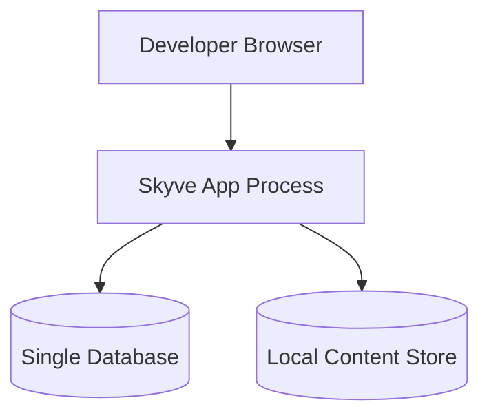

Characteristics:
1. Fast startup and debugging.
2. No high-availability guarantees.
3. Suitable for metadata and UX iteration.

### Topology B: Standard Production (HA)

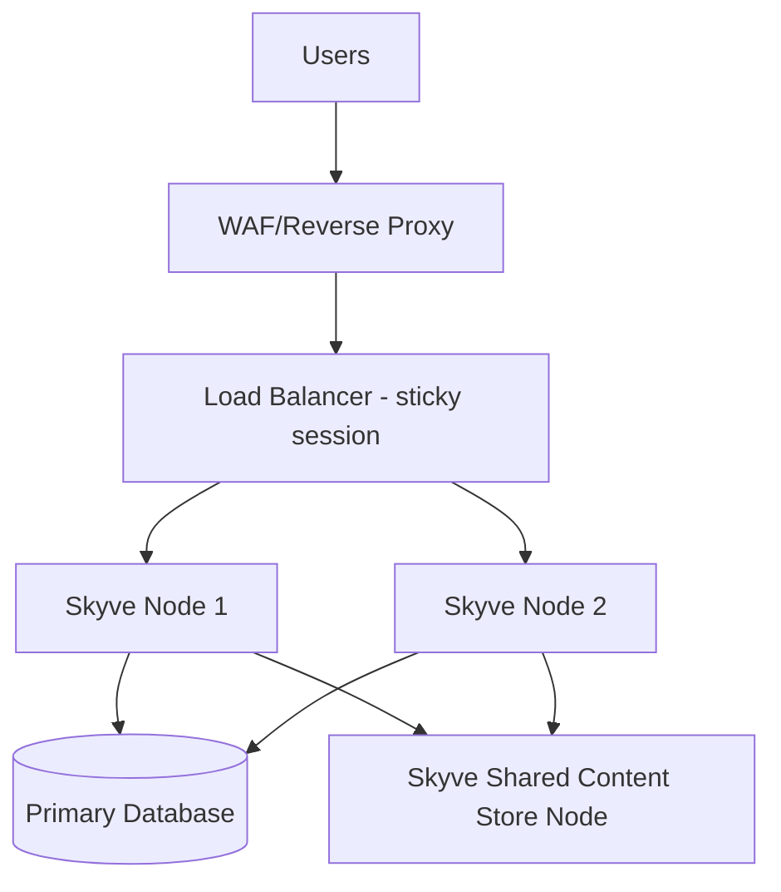

Characteristics:
1. N+1 app-node redundancy.
2. Shared state dependency for content.
3. Rolling deployments with health-gated traffic shifts.

### Topology C: Resilient Multi-Zone Production

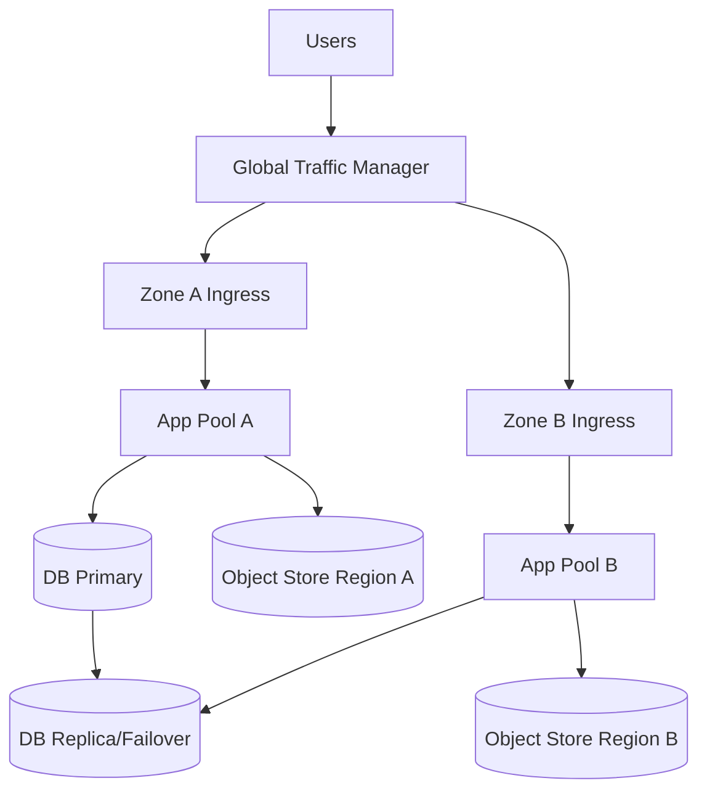

Characteristics:
1. Zone-level fault tolerance.
2. Explicit failover runbooks for database and content access.
3. Requires tested replication lag and consistency thresholds.

### Deployment Guardrails

- Terminate TLS at the edge and re-encrypt in transit where required by policy.
- Isolate admin interfaces and operational endpoints on restricted networks.
- Configure per-environment cache expiry and size limits, not hard-coded defaults.

---

## 5. Architecture Decision Records (ADR) Index

The following ADRs define currently accepted architecture decisions. Status values: `Accepted`, `Proposed`, `Superseded`.

| ADR | Title | Status | Summary |
|-----|-------|--------|---------|
| [ADR-001](adr/ADR-001-metadata-first-system-definition.md) | Metadata-First System Definition | Accepted | Business capabilities are declared in metadata, with runtime interpretation and optional generation. |
| [ADR-002](adr/ADR-002-mandatory-generatedomain-validation-gate.md) | Mandatory `generateDomain` Validation Gate | Accepted | Build and release paths must run full metadata validation before deployment. |
| [ADR-003](adr/ADR-003-declarative-role-and-scope-authorization.md) | Declarative Role and Scope Authorization | Accepted | Security permissions are modeled declaratively and enforced centrally. |
| [ADR-004](adr/ADR-004-conversation-oriented-web-interaction-model.md) | Conversation-Oriented Web Interaction Model | Accepted | Rich tab-local state is preserved server-side for multi-step interactions. |
| [ADR-005](adr/ADR-005-multi-renderer-view-interpretation.md) | Multi-Renderer View Interpretation | Accepted | A single metadata view model feeds Faces, SmartClient, Vue, and Flutter pipelines. |
| [ADR-006](adr/ADR-006-database-portability-via-dialect-delegation.md) | Database Portability via Dialect Delegation | Accepted | Vendor-specific behavior is encapsulated in dialect and delegate layers. |
| [ADR-007](adr/ADR-007-fail-closed-rest-exposure.md) | Fail-Closed REST Exposure | Accepted | REST endpoints are blocked by default and explicitly enabled by deployment choice. |
| [ADR-008](adr/ADR-008-pluggable-content-indexing-strategy.md) | Pluggable Content Indexing Strategy | Accepted | Content indexing/storage providers are selected through a stable SPI boundary. |

---

## 6. Threat Model and Trust Boundaries

### Primary Trust Boundaries

| Boundary | Crossing Actors | Main Risks | Controls |
|----------|-----------------|------------|----------|
| Internet edge -> web tier | End users, API clients | Injection, forced browsing, token replay | Security headers, access vectors, CSRF controls, auth filters |
| Web tier -> persistence | Application runtime, DB | Unauthorized row access, privilege escalation | Scope-aware permissions, filtered queries, transaction demarcation |
| Web tier -> content/index | App runtime, storage/index backends | Data leakage, stale index views, tampering | Tenant metadata linkage, controlled SPI, authenticated service calls |
| Admin/operator plane -> runtime | Operators, deployment automation | Misconfiguration, accidental exposure | Environment separation, least privilege, change control |

### Key Abuse Cases

| Abuse Case | Example | Primary Mitigation |
|------------|---------|--------------------|
| Forced browsing | Guessing module/document/action URLs | `UserAccess` vector checks and route enforcement |
| Over-posting | Client submits non-editable fields | Payload shaping and permission-filtered input processing |
| Cross-tenant access | Manipulated IDs or query filters | Scope enforcement via `bizCustomer`/`bizDataGroupId`/`bizUserId` |
| Session misuse | Reusing stale conversation state | Session ownership checks in conversation restore |
| REST surface drift | Unintended endpoint availability | Fail-closed REST filter with explicit opt-in |

### Security Review Triggers

- New endpoint categories or transport protocols.
- Changes to authentication providers or token lifecycle.
- Any modification to permission-scope merge semantics.

---

## 7. Operability, Observability, and Incident Response

### Telemetry Model

| Signal | Minimum Requirement | Example Use |
|--------|---------------------|-------------|
| Logs | Structured request, auth, and error events with correlation IDs | Trace request failures across filters and handlers |
| Metrics | RED metrics (rate, errors, duration) and resource saturation | Alert on SLO breach risk before outage |
| Traces | End-to-end request spans including persistence and content calls | Diagnose latency hotspots and retry storms |
| Audit | Security-sensitive action audit trail | Investigate access and change history |

### SLO Alerting Policy

| Alert Class | Trigger | Initial Response Time |
|-------------|---------|-----------------------|
| Critical | Availability or error budget burn indicates imminent SLO breach | <= 15 minutes |
| High | Sustained p95 latency violation or auth failure spike | <= 30 minutes |
| Medium | Non-critical dependency degradation | <= 4 hours |

### Minimum Runbooks

1. Node saturation and horizontal scaling response.
2. Database failover and rollback procedure.
3. Cache corruption or cache-thrashing remediation.
4. Content/index desynchronisation recovery.
5. Credential/key rotation and incident containment.

### Operational Ownership

- Platform team owns framework-level SLO definitions and telemetry standards.
- Application teams own module-level performance budgets and release verification.
- Security function owns policy baselines, exception process, and periodic control testing.

---

## 8. Evolution, Versioning, and Compatibility Policy

### Compatibility Guarantees

| Surface | Compatibility Goal | Breaking Change Policy |
|---------|--------------------|------------------------|
| Metadata schema | Backward compatible within major version | Breaking changes require major-version uplift and migration tooling |
| Public Java APIs | Source compatibility for supported extension points | Deprecated first, removal only after documented window |
| Runtime behavior | Stable semantics for permission scope and validation | Any semantic change requires ADR + migration notes |
| REST contracts | Additive by default | Field removals/renames require versioned endpoint strategy |

### Deprecation Lifecycle

1. Mark as deprecated with explicit replacement path.
2. Emit build-time or startup warning where feasible.
3. Maintain compatibility for at least one minor release train.
4. Remove only with release note migration instructions and automated checks where possible.

### Data and Schema Evolution Rules

- Schema coercion support does not replace migration planning for high-volume production datasets.
- All schema-impacting changes must be tested with representative data volumes and rollback plans.
- Backup and restore validation is mandatory before production rollout of structural changes.

### Contract Testing Expectations

- Maintain regression suites for metadata validation, role scope enforcement, and persistence mappings.
- Include compatibility tests for customer overrides and multi-UI route selection.

---

## 9. Architecture Governance Checklist

Use this checklist before merging architecture-significant changes:

1. Decision recorded in ADR index (new or amended).
2. Impact on SLOs and capacity assumptions documented.
3. Threat model impact reviewed.
4. Deployment and rollback implications verified.
5. Observability and alert coverage updated.
6. Compatibility/deprecation implications documented.
7. Recovery drill or test evidence attached for data-plane changes.

The remainder of this document is the implementation-oriented reference section that maps these governance controls to concrete modules, runtime paths, and extension points.

## 10. Module Layout

Skyve is structured as a multi-module Maven project (Java 17, version 10.0.0-SNAPSHOT). Dependencies flow strictly downstream: `skyve-core` → `skyve-ext` → `skyve-web` → `skyve-war`.

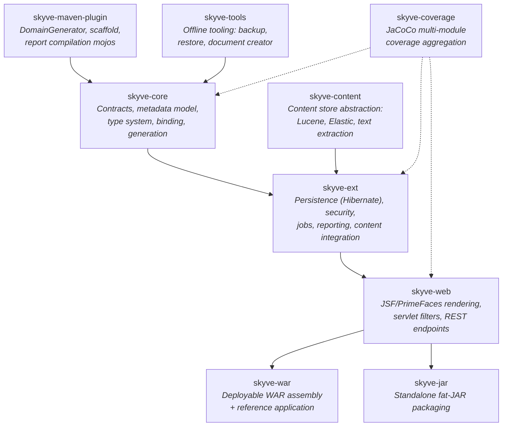

| Module | Package Roots | Purpose |
|--------|--------------|---------|
| `skyve-core` | `org.skyve`, `org.skyve.metadata`, `org.skyve.impl`, `org.skyve.domain`, `org.skyve.util` | Public API, metadata interfaces, domain types, binding, expression evaluation, domain generation |
| `skyve-ext` | `org.skyve.impl.persistence`, `org.skyve.impl.security`, `org.skyve.job`, `org.skyve.report` | Hibernate persistence, security providers, job scheduling, reporting engines |
| `skyve-web` | `org.skyve.impl.web`, `org.skyve.impl.web.faces` | JSF managed beans, servlet filters, REST endpoints, push infrastructure |
| `skyve-content` | `org.skyve.content` | Content manager SPI, Lucene/Elastic implementations, text extraction |
| `skyve-war` | Application code | WAR assembly with Spring Security configuration |
| `skyve-maven-plugin` | `org.skyve.impl.tools` | Maven mojos for domain generation, scaffolding, report compilation |
| `skyve-tools` | `org.skyve.impl.tools` | Backup/restore utilities, document creator |
| `skyve-jar` | — | Standalone packaging (shaded JAR) |
| `skyve-coverage` | — | JaCoCo aggregation (no production code) |

---

## 11. Metadata-Driven Architecture

All application behaviour derives from XML metadata that is validated, converted to runtime objects, and optionally used to generate Java source code. This eliminates boilerplate and ensures static validation before deployment.

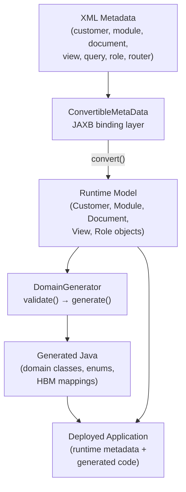

### Static Validation Pipeline

Validation occurs at two levels before any application runs:

1. **Isolated file validation** — each `ConvertibleMetaData` implementation validates and converts itself:
   - `CustomerMetaData` → runtime `Customer`
   - `ModuleMetaData` → runtime `Module`
   - `DocumentMetaData` → runtime `Document`
   - `ViewMetaData` → runtime `ViewImpl`
   - `ActionMetaData`, `BizletMetaData` → self-validate only
   - `Router` → validated route configuration

2. **Cross-metadata validation** — `ProvidedRepository` validates dependencies between metadata files:
   - `validateCustomerForGenerateDomain()` — customer-level consistency
   - `validateModuleForGenerateDomain()` — module references and roles
   - `validateDocumentForGenerateDomain()` — document relations and attributes
   - `validateViewForGenerateDomain()` — view bindings against document model

`DomainGenerator.validateCustomer()` iterates all modules, documents, and views (including per-UX/UI variants) calling these four methods, ensuring complete consistency before code generation.

Additionally, `ValidateMetaDataJob` runs asynchronously on startup to validate all customers in the background.

---

## 12. Layered Architecture

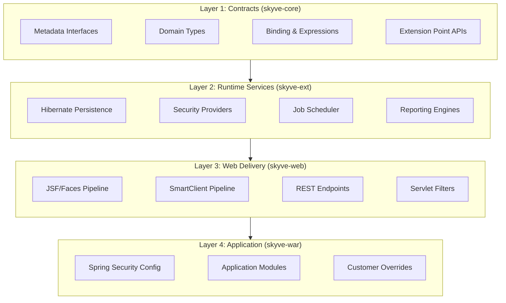

Each layer depends only on layers above it. Application code in `skyve-war` interacts exclusively through public APIs defined in `skyve-core`, with runtime services injected via CDI or Spring.

---

## 13. Request Lifecycle

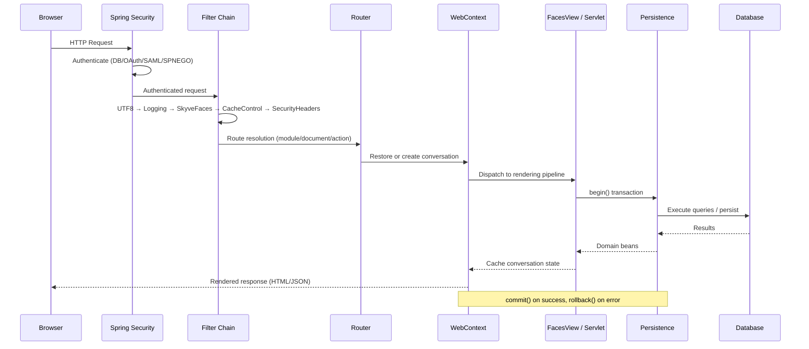

### Filter Chain (Registration Order)

| Order | Filter | Scope | Purpose |
|-------|--------|-------|---------|
| 1 | `DelegatingFilterProxy` | `/*` | Spring Security authentication/authorization |
| 2 | `UTF8CharacterEncodingFilter` | `/*` | Force UTF-8 encoding |
| 3 | `RequestLoggingAndStatisticsFilter` | `/*` | Request logging, per-user web stats |
| 4 | `SkyveFacesFilter` | `FacesServlet`, `*.jsp` | Login gating, unsecured-path checks |
| 5 | `CacheControlFilter` | `FacesServlet` | `no-cache, no-store, must-revalidate` |
| 6 | `ResponseHeaderFilter` (NeverExpires) | `*.js`, fonts, `*.wasm` | One-year public cache |
| 7 | `ResponseHeaderFilter` (PublicCache) | `*.css`, images | `Cache-Control: public` |
| 8 | `ResponseHeaderFilter` (SecurityHeaders) | `/*` | CSP, X-Frame, Referrer-Policy, MIME-sniffing |
| 9 | `ForbiddenFilter` (RestFilter) | `/rest/*` | Fail-closed REST by default |

### Routing

`Router` (loaded from `router.xml`) contains ordered per-UX/UI `Route` lists. A `RouteCriteria` tuple (`WebAction`, `ViewType`, module, document, query, customer, data-group, user) is matched against routes; `selectRoute()` returns the first match. URL parameters `a`, `m`, `d`, `q`, `i` resolve to action, module, document, query, and bean identity respectively.

---

### 13.a Core Class Relationships

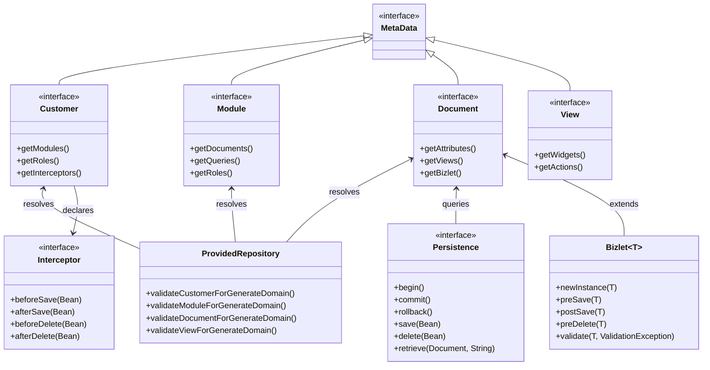

---

## 14. Metadata Model

| Metadata Type | Runtime Class | Validation Path | Description |
|---------------|--------------|-----------------|-------------|
| Customer | `CustomerImpl` | `validateCustomerForGenerateDomain()` | Tenant root: modules, roles, interceptors, converters, branding |
| Module | `ModuleImpl` | `validateModuleForGenerateDomain()` | Groups documents, queries, roles, menu; supports cross-module refs via `DocumentRef` |
| Document | `DocumentImpl` | `validateDocumentForGenerateDomain()` | Business entity: attributes, relations, views, actions, bizlets, unique constraints |
| View | `ViewImpl` | `validateViewForGenerateDomain()` | Screen declaration (edit/create/list); per-customer and per-UX/UI overrides |
| Role | Aggregated into `UserImpl` | Module-level validation | Document permissions with CRUD + scope; union semantics across assigned roles |
| Query | `MetaDataQueryDefinitionImpl` | Module-level validation | Projected tabular result set with filter criteria relative to a driving document |
| Router | `RouterImpl` | Isolated conversion | UX/UI selectors, route lists, unsecured URL prefixes |

### Resolution Order

`ProvidedRepository` resolves metadata with customer-override-awareness: `FileSystemRepository` populates customer override keys first, then vanilla module keys. This means any tenant can override any module's documents, views, or actions without modifying the base application.

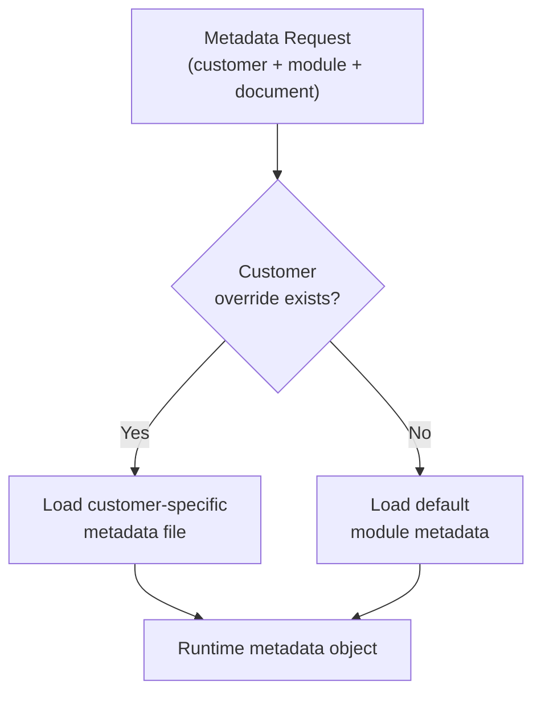

---

## 15. Type System

### Scalar Attribute Types

| Skyve Type | Java Type | Notes |
|------------|-----------|-------|
| `text` | `String` | Plain text |
| `memo` | `String` | Long text |
| `markup` | `String` | Rich HTML content |
| `colour` | `String` | Colour code |
| `date` | `DateOnly` | Date without time |
| `time` | `TimeOnly` | Time without date |
| `dateTime` | `DateTime` | Date and time |
| `timestamp` | `Timestamp` | Full precision timestamp |
| `integer` | `Integer` | 32-bit integer |
| `longInteger` | `Long` | 64-bit integer |
| `decimal2` | `Decimal2` | Fixed 2-decimal-place arithmetic |
| `decimal5` | `Decimal5` | Fixed 5-decimal-place arithmetic |
| `decimal10` | `Decimal10` | Fixed 10-decimal-place arithmetic |
| `bool` | `Boolean` | Boolean |
| `enumeration` | Generated `Enum` | Code/description duality via `Enumeration` interface |
| `id` | `String` | UUID primary key |

### Special Storage Types

| Skyve Type | Java Type | Special Behaviour |
|------------|-----------|-------------------|
| `content` | `String` (content ID) | References blob in content store; text-extracted and indexed for federated search |
| `image` | `String` (content ID) | Same as content but typed for image rendering |
| `geometry` | `Geometry` (JTS) | First-class spatial type; persisted via Hibernate Spatial; indexed by spatial DB extensions |

### Relational Types

| Skyve Type | Java Type | Semantics |
|------------|-----------|-----------|
| `association` | `Bean` | Many-to-one reference (aggregation or composition) |
| `collection` | `List` | One-to-many or many-to-many (composition or aggregation) |
| `inverseOne` | `Bean` | Inverse of a to-one association |
| `inverseMany` | `List` | Inverse of a to-many collection |

### Extension Points

- **`Converter<T>`** — bidirectional type↔display-string conversion; includes optional `Format` mask and `Validator` post-parse.
- **`Validator<T>`** — appends `Message`s to `ValidationException`; invoked after converter parse.
- **`Decimal`** — abstract base enforcing fixed-scale arithmetic; subclasses `Decimal2`, `Decimal5`, `Decimal10`.
- **`Enumeration`** — contract for generated enums; stable `code` for persistence, localised `description` for UI.

---

## 16. Persistence & Data Model

### Supported Relation and Inheritance Strategies

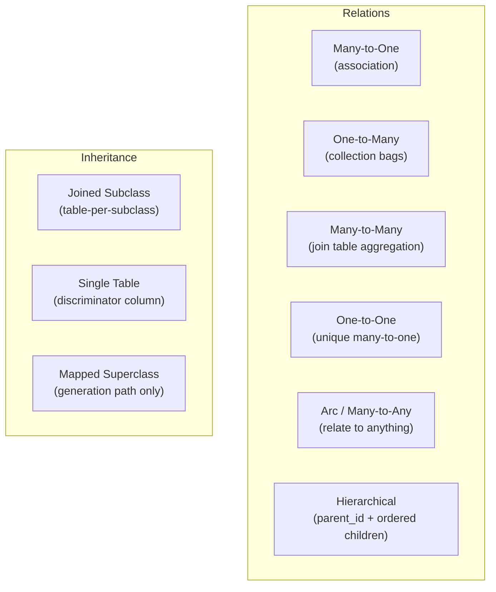

| Strategy | Skyve Mapping | Database Artefact |
|----------|--------------|-------------------|
| Many-to-one aggregation | `<association type="aggregation">` | FK column on owning table |
| Many-to-one composition | `<association type="composition">` | FK column with cascade delete |
| One-to-many composition (joining) | `<collection type="composition" joining>` | Join table |
| One-to-many composition (owning) | `<collection type="composition">` | FK on child table |
| Many-to-many aggregation | `<collection type="aggregation">` | Dedicated join table |
| One-to-one | `<association>` with unique constraint | Unique FK |
| Arc (relate to anything) | `<any>` / `<many-to-any>` | Type discriminator + ID columns |
| Hierarchical | `parentId` + ordered children | Self-referencing FK |
| Joined inheritance | `<persistent strategy="joined">` | Per-subclass table with shared PK |
| Single-table inheritance | `<persistent strategy="single">` | Discriminator column |
| Mapped superclass | `<persistent strategy="mapped">` | No table; fields inherited into subclass tables |

### Persistence API

`Persistence` is thread-confined (one per request thread via `ThreadLocal`). Key operations:

- `begin()` / `commit()` / `rollback()` — transaction lifecycle
- `save(Bean)` / `delete(Bean)` / `retrieve(Document, String)` — CRUD
- `newDocumentQuery(Document)` — metadata-driven JPQL query builder
- `newSQL(String)` / `newBizQL(String)` — native SQL and Skyve query language
- `newNamedQuery(Module, String)` — execute metadata-defined queries

Query types:
- **`DocumentQuery`** — fluent metadata-driven query with joins, projections, grouping, ordering, paging.
- **`DocumentFilter`** — fluent predicate builder (null-aware, collection-size, spatial predicates).
- **`SQL`** — native SQL with Skyve-type-aware parameter binding; supports scalar/tuple/bean/dynamic results and streaming iterables.
- **`BizQL`** — Skyve object query language (JPQL-like over domain beans) with parameters, paging, and DML.

Results are lazy `Map` instances exposing the domain interface until a real bean is required — avoiding unnecessary instantiation.

### Dialect Extensions & Schema Evolution

`SkyveDialect` extends Hibernate dialects with spatial conversion and schema-evolution hooks. `DDLDelegate` supplements Hibernate's DDL with alter-column coercion when type, length, or precision changes.

| Dialect | Database | Notable Capabilities |
|---------|----------|---------------------|
| `AbstractH2SpatialDialect` | H2 (GeoDB) | Test-oriented spatial; `NULLS DISTINCT` unique constraints (H2 2.2+) |
| `MySQL8InnoDBSpatialDialect` | MySQL 8 | Spatial index DDL tuning; `LONGVARCHAR` false-positive suppression |
| `PostgreSQL10SpatialDialect` | PostgreSQL (PostGIS) | `lower()` `text_pattern_ops` index exporter |
| `SQLServer2012SpatialDialect` | SQL Server | Geometry conversion; `TRANSACTION_SNAPSHOT` isolation |

---

## 17. Security Architecture

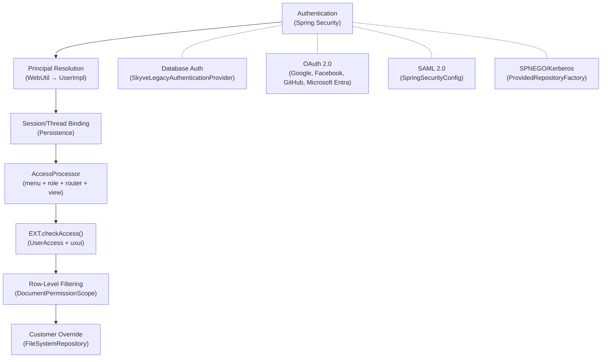

### Security Components

| Component | Location | Responsibility |
|-----------|----------|---------------|
| `User` | skyve-core | Authenticated principal: identity, customer, roles, permissions, access checks |
| `UserImpl` | skyve-core | Stores resolved permissions, action/content permissions, executes `canReadBean`/`canAccess` |
| `Role` | skyve-core | Module-declared permission group; union semantics across multiple assigned roles |
| `DocumentPermission` | skyve-core | CRUD + scope (global/customer/dataGroup/user/none); merge semantics for aggregation |
| `DocumentPermissionScope` | skyve-core | Row visibility hierarchy enforcing data-group and user ownership boundaries |
| `UserAccess` | skyve-core | Immutable access-request key (singular, aggregate, report, content, dynamic image) |
| `AccessProcessor` | skyve-core | Builds per-user access vectors from menu, role, router, and view metadata |
| `BasicAuthFilter` | skyve-web | REST HTTP Basic auth; validates credentials; establishes persistence user context |
| `SkyveSpringSecurity` | skyve-web | Spring Security wiring: JDBC user details + OAuth client registrations |
| `SkyveLegacyAuthenticationProvider` | skyve-ext | Direct-SQL credential authentication (legacy database auth) |
| `SkyveRememberMeTokenRepository` | skyve-ext | JDBC remember-me token persistence |

### Multi-Tenancy Model

Row-level isolation is enforced via `Bean` ownership fields: `bizCustomer`, `bizDataGroupId`, `bizUserId`. `DocumentPermissionScope` controls which rows a user can see based on their relationship to these fields. `MetaDataQueryDefinitionImpl` automatically substitutes `{DATAGROUPID}` tokens to restrict query results to the user's data group.

### OWASP Protections

- CSRF token rotation (managed in conversation cache)
- CSP, X-Frame-Options, Referrer-Policy, X-Content-Type-Options headers (SecurityHeadersFilter)
- Input encoding via `org.owasp.encoder`
- Fail-closed REST (ForbiddenFilter blocks `/rest/*` by default)
- Session fixation prevention (conversation-session binding in `StateUtil`)

---

## 18. UI Rendering Pipelines

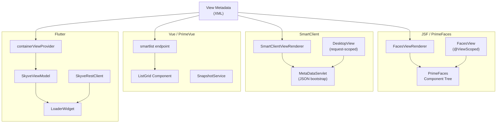

### Pipeline Characteristics

| Pipeline | Entry Point | Rendering Model | State Management |
|----------|-------------|-----------------|------------------|
| **JSF/Faces** | `FacesView` (`@Named("skyve")`, `@ViewScoped`) | Server-side component tree built by `FacesViewRenderer` from metadata | Conversation cached via `StateUtil`; `SkyveFacesPhaseListener` restores/caches per request |
| **SmartClient** | `DesktopView` (request-scoped) | `SmartClientViewRenderer` generates JavaScript; `MetaDataServlet` serves JSON | Conversation via `SmartClientEditServlet`/`SmartClientListServlet` |
| **Vue** | `SKYVE.listgrid` in `main.js` | PrimeVue `ListGrid` mounted into server-provided container; POSTs to `smartlist` | Snapshots persisted via `SnapshotService` (`type=vue`) |
| **Flutter** | `SkyveRestClient` | `containerViewProvider` fetches view JSON; `SkyveViewModel` interprets into widgets | Client-side; `LoaderWidget` fetches `smartedit` payloads |

### Isomorphic Rendering

All pipelines render from the same view metadata. The `UxUiSelector` chooses the active renderer based on `UserAgentType` detection and servlet context. Router metadata declares per-UX/UI route variants, enabling device-specific view selection from a single definition.

### Conversation State Model

Each browser tab/popup is a `WebContext` — a server-side conversation holding the current bean, cached beans, pending messages, and persistence state. `AbstractWebContext` carries `sessionId`, bean map, and the derived `webId` (conversation UUID + current bean ID). `StateUtil` serializes conversations into an EHCache region; session ownership is validated on restore to prevent cross-session hijacking.

---

## 19. Content Management & Search

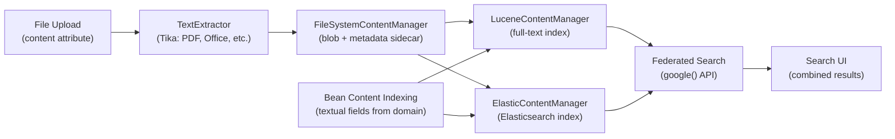

### Content Architecture

- **`ContentManager`** — SPI with `put(BeanContent)`, `put(AttachmentContent)`, `getAttachment(String)`, `removeBean(String)`, `removeAttachment(String)`, `google(String, int)` for federated search.
- **`AbstractContentManager`** — base with filesystem/metadata helpers; metadata ties content to `bizCustomer`, `bizModule`, `bizDocument`, `bizId`, `attributeName`.
- **`FileSystemContentManager`** — default store: assigns `contentId`, sniffs MIME via `TextExtractor`, writes bytes + sidecar metadata.
- **`LuceneContentManager`** — extends filesystem; indexes both `BeanContent` and `AttachmentContent` into a single Lucene `CONTENT` field.
- **`ElasticContentManager`** — Elasticsearch-backed implementation (two-index search shape).
- **`DelegatingContentManager`** — facade forwarding to the configured implementation.
- **`TikaTextExtractor`** — PF4J plugin using Apache Tika for PDF, Office, and other format extraction.

### Transactional Content Relations

Content is stored transactionally alongside database operations:
- `HibernateContentPersistence` opens a `ContentManager` and calls `putBeanContent`/`removeBeanContent` so index updates track persistence work.
- `AbstractHibernatePersistence` builds `BeanContent` from fields marked `IndexType.textual` or `IndexType.both`, running markup through `TextExtractor`.
- `AttachmentContent` carries full bean linkage (`bizCustomer`, `bizModule`, `bizDocument`, `bizDataGroupId`, `bizUserId`, `bizId`, `attributeName`).

### Federated Search

`google(String, int)` searches across both structured bean data and file content, returning `SearchResult` DTOs with `contentId`, `bizId`, excerpt, score, and document coordinates. The UI presents combined results from both indexes transparently.

---

## 20. Jobs & Background Tasks

| Concept | Class | Scheduling | Persistence Mode | UI Context |
|---------|-------|-----------|------------------|------------|
| **Job** | `Job` / `CancellableJob` / `IteratingJob<T>` | Cron, one-shot, ad-hoc via UI | Async timeouts (`setAsyncThread(true)`) | None — runs under a designated user |
| **ViewBackgroundTask** | `ViewBackgroundTask<T>` | Triggered from UI action | Async timeouts | Full — `execute(bean)` against cached conversation |

### Job Infrastructure

- **`JobScheduler`** — scheduling facade for one-shot, dated, cron, scheduled reports, background tasks, restore orchestration, and content GC.
- **`QuartzJobScheduler`** — Quartz-backed implementation registering module-declared jobs at startup; triggers via `runOneShotJob()` / `runBackgroundTask()`.
- **`AbstractSkyveJob`** — Quartz bridge wrapping transaction lifecycle and persisting execution history.
- **`JobMetaData`** — module XML descriptor carrying display name, class, and owning module.
- **`NaturalCronExpressionParser`** — converts human-readable phrases (e.g., "every weekday at 9am") to validated six-field cron expressions.

### ViewBackgroundTask vs Job

A `ViewBackgroundTask` is a short-running asynchronous process kicked off from a UI interaction. It operates against the same persistence instance and conversation cache as the originating request — same L1 cache, same local UI mutations. A `Job` is a long-running scheduled process with its own transaction lifecycle, independent of any UI conversation.

---

## 21. Reporting

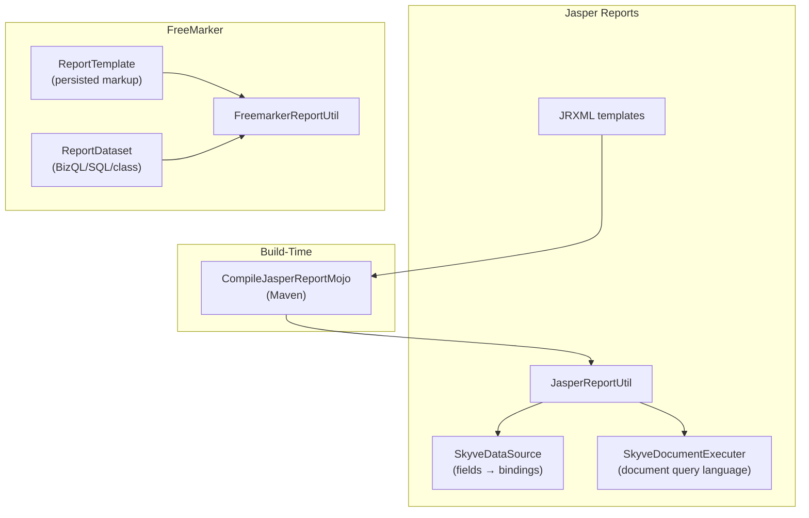

### Jasper Integration

- `JasperReportUtil` — runs bean, SQL, or metadata-driven reports; injects `RESOURCE_DIR`/`SUBREPORT_DIR`; resolves compiled reports via repository metadata.
- `SkyveDataSource` — binds Jasper fields to Skyve bindings; field descriptions yield formatted values; `THIS` and `USER` expose current bean/user.
- `SkyveDocumentExecuter` — custom query executer for document-language JRXML.
- `CompileJasperReportMojo` — Maven mojo compiling `.jrxml` to `.jasper` at build time.

### FreeMarker Integration

- `FreemarkerReportUtil` — template loading, HTML-to-PDF conversion, download support.
- `ReportTemplate` — persisted report template with markup, parameters, and dataset definitions.
- `ReportDataset` — typed dataset metadata (BizQL, SQL, constant, class-backed via `BeanReportDataset`).
- `ReportParameter` — typed parameter with `setReportInputValue()` for execution-time overrides.

Reports are declared in module metadata and resolved by `ProvidedRepository.getReportFileName()` using customer/document/report name with Jasper/FreeMarker suffix conventions.

---

## 22. Import / Export

### BizPort (Full Graph Exchange)

- **`BizPortWorkbook`** — workbook root for bulk Excel exchange; owns sheets by module/document key with validations, dropdowns, and FK constraints.
- **`StandardGenerator`** — derives workbook structure from document metadata; recursively exports object graphs via collection/join sheets + FK columns.
- **`StandardLoader`** — reconstructs beans from document sheets; links associations via FK columns; links collections from collection sheets.
- **`BizExportAction`** / **`BizImportAction`** — metadata action extension points.

### Quick Import/Export (Tabular)

- **`AbstractDataFileLoader`** — simpler metadata-driven tabular import mapping columns to bindings with referential integrity support.
- **`CSVLoader`** — CSV implementation with text/date/numeric coercion.
- **`DataFileField`** — per-column mapping rule (binding, required flag, converter, load action: SET_VALUE, LOOKUP_EQUALS, LOOKUP_LIKE, CONFIRM_VALUE).
- **`POISheetGenerator`** — tabular export writing bindings/query results to styled `.xlsx`.

### Backup / Restore

- **`BackupJob`** / **`RestoreJob`** — cancellable jobs producing/consuming versioned ZIP archives with schema handling and content restore.
- **`BackupUtil`** — platform-independent backup/restore (backup from SQL Server, restore to H2).
- **`ExternalBackup`** / **`AzureBlobStorageBackup`** — off-site storage integrations.
- **`ExportedReference`** — tracks cross-module references for dependency ordering during restore.

---

## 23. Spatial

Geometry is a **first-class attribute type** in Skyve — not an add-on. Spatial capabilities are woven through the type system, persistence layer, query API, and UI rendering.

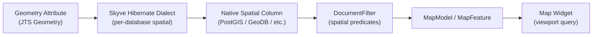

### Spatial API

- **`DocumentFilter`** — fluent spatial predicates: `within`, `contains`, `crosses`, `disjoint`, `intersects`, `overlaps`, `touches`.
- **`MapModel<T>`** — SPI returning map features for a viewport geometry.
- **`DefaultMapModel`** — binds geometry field, clips by map bounds, emits `MapItem`/`MapFeature`.
- **`DocumentQueryMapModel`** — drives map directly from metadata query.
- **`ReferenceMapModel`** — maps collection/association from current bean into features.
- **`GeometryConverter`** — converts JTS Geometry values to/from WKT text.

### Database Spatial Support

| Dialect Delegate | Database | Capabilities |
|-----------------|----------|--------------|
| `PostgreSQLSpatialDialectDelegate` | PostgreSQL/PostGIS | EWKB conversion, PostGIS typing, DDL checks |
| `MySQLSpatialDialectDelegate` | MySQL | WKB conversion, index adaptations |
| `SQLServerSpatialDialectDelegate` | SQL Server | Geometry encoding/decoding, uniqueness handling |
| `AbstractH2SpatialDialect` | H2 (GeoDB) | Test-oriented spatial base |
| `MySQL5SpatialFunctions` / `MySQL8SpatialFunctions` | MySQL | Registered spatial function sets (distance, buffer, intersection, union) |

---

## 24. Extension Points

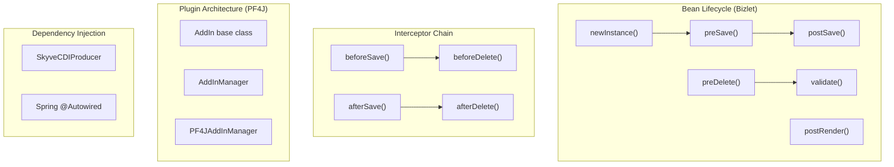

| Extension Point | Mechanism | Declaration |
|----------------|-----------|-------------|
| **Bizlet** | Subclass `Bizlet<T>` per document; lifecycle callbacks from `newInstance` through `postRender` | Convention: `{module}.{document}.{Document}Bizlet` class |
| **Interceptor** | Implement `Interceptor`; before methods can short-circuit; after methods run in reverse order | Declared in customer XML metadata |
| **Observer** | Implement `Observer` for startup, shutdown, login, logout, backup, restore events | Declared in customer XML metadata |
| **Converter** | Implement `Converter<T>` for custom type↔display conversion | Referenced in attribute metadata |
| **Validator** | Implement `Validator<T>` for custom validation rules | Referenced in converter or attribute metadata |
| **AddIn (Plugin)** | Extend `AddIn` base class; discovered via PF4J `AddInManager` at runtime | Packaged in separate Maven module; placed in add-ins directory |
| **CDI/Spring** | `SkyveCDIProducer` exposes `Persistence`, `Repository`, `Caching`, `JobScheduler`, `AddInManager` | Standard `@Inject` / `@Autowired` |

### CDI Proxies

`PersistenceInjectable` and `RepositoryInjectable` are stateless, serializable proxies that delegate injected calls to `CORE` at use time — ensuring CDI-injected services always resolve to the current thread's active instance.

---

## 25. Caching

| Cache Region | Implementation | Purpose |
|--------------|---------------|---------|
| Conversations | `ConversationCacheConfig` → EHCache | Serialized `WebContext` per browser tab (idle-expiring) |
| CSRF Tokens | `DefaultCaching` | Per-session CSRF token rotation |
| GeoIP | `DefaultCaching` | Cached geolocation lookups |
| Session | `DefaultCaching` | Session-scoped application data |
| App | `DefaultCaching` | Application-scoped shared data |
| Hibernate L2 | `HibernateCacheConfig` | Entity and collection caching (declared in document metadata via `<persistent>` cache element) |

### Cache API

- **`Caching`** — management API for creating, retrieving, destroying, and inspecting cache regions (EHCache and JCache).
- **`CacheConfig`** — abstract descriptor declaring name, sizing, expiry, key/value types.
- **`EHCacheConfig`** — Ehcache-specific: disk/persistence options, heap/off-heap sizing.
- **`JCacheConfig`** — provider-neutral shared caches.
- **Conversation caching** — `StateUtil` serializes `WebContext` into the conversations region keyed by conversation UUID; validates session ownership on restore.
- **Document metadata** — `<persistent>` element declares a named cache region; `<collection>` elements can specify shared cache names.
- **`SingletonCachedBizlet`** — memoises singleton document `bizId`s; relies on Hibernate L2 cache for actual bean retrieval.
- **`SkyveContextListener`** — initializes conversation cache sizing/expiry from `state.conversations` deployment configuration.

---

## 26. Web Services & APIs

### REST Endpoints

- **`RestService`** (`@Path("/api")`) — generic CRUD REST endpoint for document instances (JSON retrieval, creation, update, deletion). Blocked by `ForbiddenFilter` by default; deployments opt-in by swapping filter configuration.
- **`JaxRsActivator`** — JAX-RS `Application` subclass activating endpoint registration.
- **`MetaDataServlet`** — serves document/view/menu metadata as JSON for JavaScript clients.
- **`DocsServlet`** — forwards `/docs` to Swagger UI page.

### Shaped Payloads

`JSON` utility class in `org.skyve.util` marshals beans with optional property-name projection, enabling shaped payloads that expose only the fields needed by a particular client.

### Push Infrastructure

- **`PushMessage`** — server-to-client command envelope for growls, message displays, rerenders, and named JavaScript function invocations.
- **`SseApplication`** — JAX-RS `/sse` bootstrap for server-sent events.
- **`SseClientHandler`** — `PushMessageReceiver` streaming messages over SSE with bounded queueing, keep-alives, reconnection IDs, and per-user/global connection caps.

### JavaScript API & Injection

- **`Inject`** — view metadata element inserting custom script at the tag location during rendering.
- **`InjectBinding`** — injects bound field values into surrounding layout/script.
- **`HTMLResources`** — tenant extension hook for injecting customer-specific CSS.

### Content Remoting

- **`RestRemoteContentManagerServer`** — JAX-RS endpoint at `/rest/content` for inter-Skyve-server attachment operations (explicitly not internet-facing).
- **`RestRemoteContentManagerClient`** — HTTP client forwarding content manager calls to another Skyve server.
- **`JDBCRemoteContentManagerServer`** — JDBC-callable function bridge for remote content operations.

---

## 27. Scaffolding & Tooling

### Maven Plugin Goals

| Mojo | Purpose |
|------|---------|
| `DomainGenerator` | Validates all metadata, generates domain classes, enums, and HBM mappings |
| `CompileJasperReportMojo` | Compiles `.jrxml` templates to `.jasper` |
| `SystemDocumentationMojo` | Generates system documentation with PlantUML directives |
| Scaffold mojos | Project generation and module scaffolding |

### SAIL (Skyve Automated Integration Lifecycle)

- Generated from view metadata — produces browser-automation test scripts.
- Supports Selenese or WebDriver output formats.
- Validates that rendered UI matches metadata expectations.

### Unit Test Generation

- **CRUD domain testing** — generated tests for create, read, update, delete on every persistent document.
- **Action tests** — generated test stubs for each declared action.
- **Test data generation** — `DataBuilder` utility producing valid random bean instances respecting type constraints.
- **Data store seeding** — test infrastructure for populating the database with representative data.

### Project Generation

Skyve generates complete project scaffolding including:
- Maven POM structure
- Metadata directory layout (customer, module, document, view)
- Spring/CDI configuration
- Deployment descriptors
- Initial domain generation output

### Runtime Engineering

- **Proxy framework** — dynamic proxy generation for framework services.
- **Runtime compiling** — in-memory class loading for hot-deployed metadata changes.
- **`CachedRepository`** — extends repository contract with explicit metadata cache eviction for hot-reload and admin overrides.

---

## 28. Key Abstractions Reference

| Class/Interface | Module | Package | Description |
|----------------|--------|---------|-------------|
| `Bean` | core | `org.skyve.domain` | Base domain contract with ownership fields (`bizCustomer`, `bizUserId`, `bizDataGroupId`) |
| `PersistentBean` | core | `org.skyve.domain` | Extends Bean with persistence identity (`bizId`, `bizVersion`, `bizLock`) |
| `Customer` | core | `org.skyve.metadata.customer` | Tenant root: modules, roles, interceptors, converters, branding |
| `Module` | core | `org.skyve.metadata.module` | Groups documents, queries, roles, menu |
| `Document` | core | `org.skyve.metadata.model.document` | Business entity definition: attributes, relations, views, actions |
| `View` | core | `org.skyve.metadata.view` | UI screen declaration (edit/create/list) |
| `Persistence` | core | `org.skyve.persistence` | Transaction lifecycle, CRUD, query factory |
| `AbstractHibernatePersistence` | ext | `org.skyve.impl.persistence.hibernate` | Core Hibernate-backed persistence implementation |
| `ProvidedRepository` | core | `org.skyve.impl.metadata.repository` | Primary metadata resolution API with customer-override awareness |
| `DomainGenerator` | core | `org.skyve.impl.generate` | Validates metadata and generates domain source code |
| `Binder` / `BindUtil` | core | `org.skyve.util` / `org.skyve.impl.bind` | Dotted-path binding resolution for static and dynamic beans |
| `ExpressionEvaluator` | core | `org.skyve.impl.bind` | Pluggable expression evaluation (binding, EL, i18n, role, stash) |
| `ContentManager` | content | `org.skyve.content` | Content store SPI: put, get, remove, search |
| `JobScheduler` | core | `org.skyve.job` | Job scheduling facade (cron, one-shot, ad-hoc) |
| `Job` | core | `org.skyve.job` | Abstract background process extension point |
| `Bizlet<T>` | core | `org.skyve.metadata.model.document` | Document lifecycle extension (newInstance → postRender) |
| `Interceptor` | core | `org.skyve.metadata.controller` | Customer-registered before/after lifecycle hook |
| `Converter<T>` | core | `org.skyve.domain.types` | Bidirectional type↔display conversion |
| `Router` | core | `org.skyve.impl.metadata.repository.router` | UX/UI route selector from `router.xml` |
| `FacesView` | web | `org.skyve.impl.web.faces.views` | `@ViewScoped` JSF managed bean for Skyve interactions |
| `DocumentQuery` | core | `org.skyve.persistence` | Fluent metadata-driven JPQL query builder |
| `SQL` / `BizQL` | core | `org.skyve.persistence` | Native SQL and Skyve object query wrappers |
| `MapModel<T>` | core | `org.skyve.metadata.view.model.map` | Spatial map feature provider for viewport queries |
| `Caching` | core | `org.skyve.cache` | Cache management API (EHCache, JCache) |
| `WebContext` | core | `org.skyve.web` | Per-conversation server state for a browser tab |
| `UserAccess` | core | `org.skyve.metadata.user` | Immutable access-request key for router/view security |
| `AddInManager` | core | `org.skyve.addin` | PF4J plugin discovery and lookup API |
| `EXT` | ext | `org.skyve` | Extended runtime facade (request, JDBC, content, integration APIs) |
| `PushMessage` | web | `org.skyve.push` | Server-to-client command envelope (growl, rerender, execute) |
